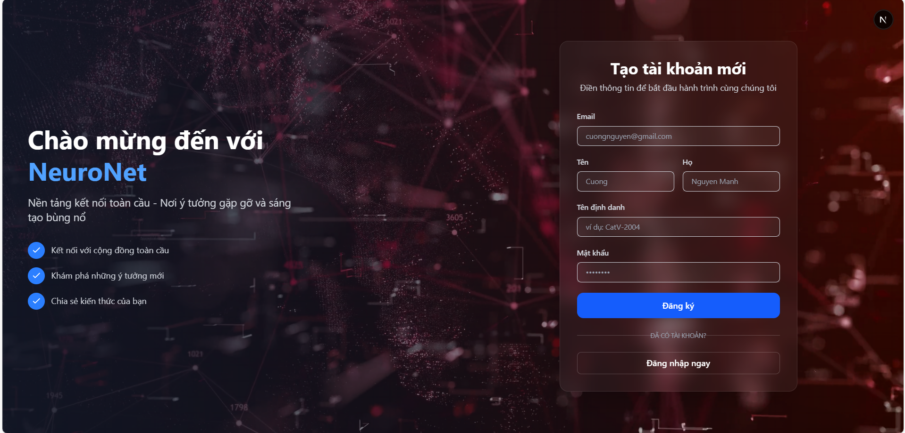
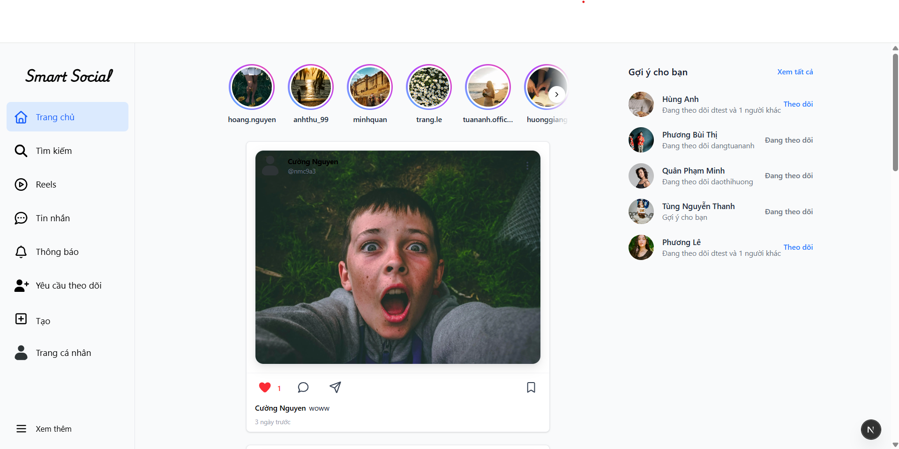
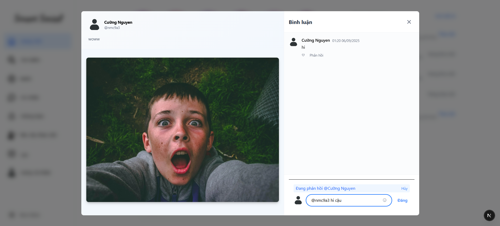
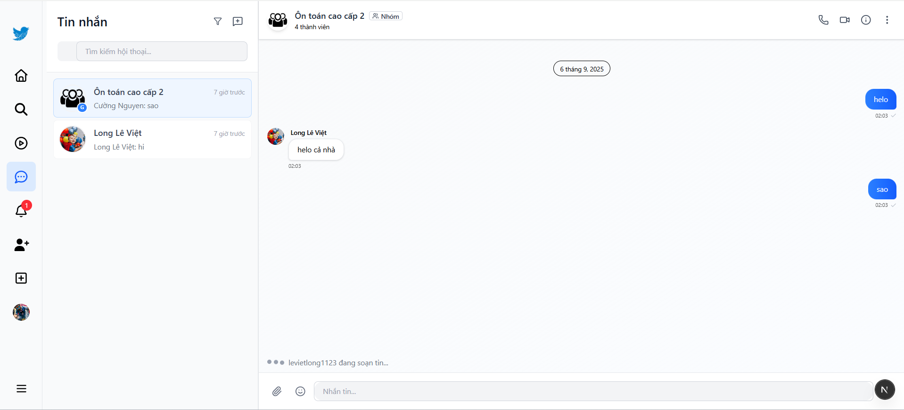
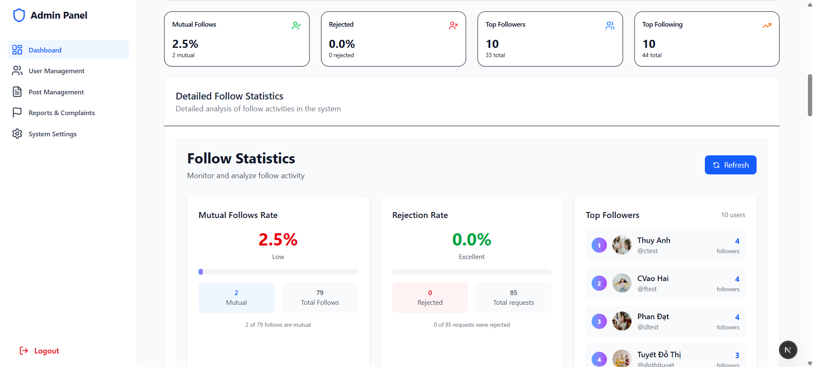
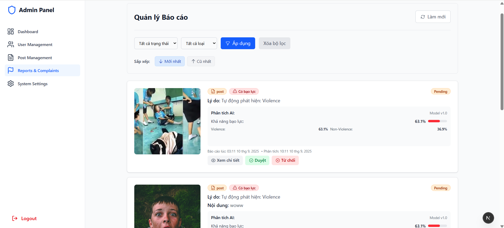

# Social Network Website Using Link Prediction Models for Follower Suggestions and Using ResNet50 for Image Classification


## Project Introduction
We developed a social networking website inspired by Instagram, consisting of two main platforms: a user-facing site and an administrator site, both powered by a SQL database(PostgreSQL).

The user site offers all the core functionalities of a modern social network, including posting, liking, commenting, following, and messaging between users. The admin site provides tools for statistical analysis and content management, such as overseeing posts, users, and user reports.

In addition, the system incorporates concepts from graph theory and applies four node-similarity–based link prediction algorithms—Common Neighbor, Jaccard, Adamic-Adar, and Katz Index—to generate follower suggestions.

## Team Members

| ID        | Name         | Facebook                          | Contribution %  |
| :-------- | :----------- | :-------------------------------- | :-------------- |
| 2251052008  | Nguyễn Mạnh Cường | [Nguyễn Mạnh Cường](https://www.facebook.com/nguyenmanhc261) | 100 |

## Technologies Used

- **Frontend**: Next.js, Redux, Tailwind CSS  
- **Backend**: Node.js, NestJS, FastAPI  
- **Real-time Communication**: Socket.IO  
- **Database**: PostgreSQL  
- **Cache**: Redis  
- **Message Queue**: RabbitMQ  
- **Search & Analytics**: Elasticsearch  
- **Graph Theory & Link Prediction**: NetworkX  
- **Computer Vision**: ResNet50  


## Class Diagram
[View Class Diagram](./image_client/classdiagram.jpg)


## Main Features of the Website
----------------
### Main Features for Users
> * Login / Register (API Token)
> * Create/Like/Comment/Report Posts
> * Follow/Search/View Other Users' Profiles
> * Real-time Notifications/Messaging
> * Manage Own Profile

### Main Features for Admins
> * Dashboard
> * Manage Posts
> * Manage Users
> * Manage Post Reports

## Demo of Some Interfaces

<details>
<summary>User Interface</summary>
  
>* Register



>* Verify email


>* Home Page



>* Create Post


>* Comment on Post



>* Search and Explore


>* Messaging



>* Notifications and Profile


</details>

<details>
<summary>Admin Interface</summary>
  
>* Dashboard



>* Manage Users


>* Manage Post Reports


</details>

## Installation Guide

### Prerequisites
- Node.js
- npm or yarn
- Python 3.x (for FastAPI and NetworkX)
- PostgreSQL (local or cloud instance)


### Frontend Setup
1. **Clone the repository and navigate to the client directory:**
   ```bash
   git clone https://github.com/CatV2004/smart-social-network?
   cd /smart-social-network/network-frontend
   
2. **Install dependencies:**
   ```bash
   npm install

3. **Start the client frontend server:**
   ```bash
   npm start
   
### Backend Setup
1. **Navigate to the backend directory and Install dependencies:**
   ```bash
   cd /smart-social-network/network-backend
   npm install

2. **Set up environment variables:**
   ```bash
   cp .env.example .env

3. **Start the backend server:**
   ```bash
   npm start
   
### FastAPI Setup (for follower suggestion)
1. **Install FastAPI, NetworkX and required libraries:**
   ```bash
   pip install fastapi uvicorn networkx
   npm install
   
2. **Navigate to the FastAPI directory:**
   ```bash
   cd /smart-social-network/network-backend/ai-service

3. **Start the FastAPI server::**
   ```bash
   uvicorn app.main:app --host 127.0.0.1 --port 8000 --reload --log-level info
  
## Related Project
- [Redesign-Microservice](https://github.com/)

